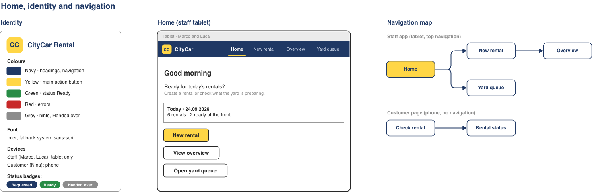
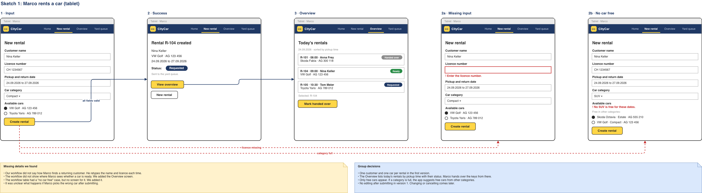
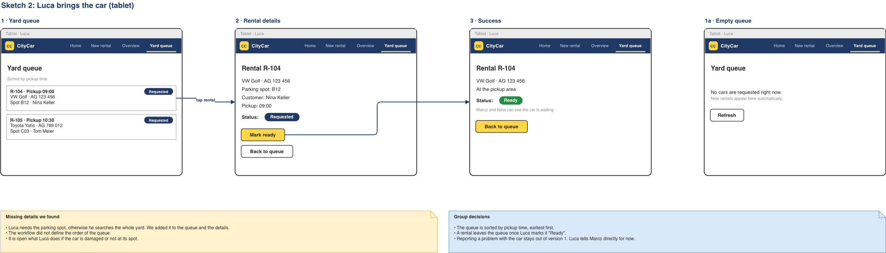
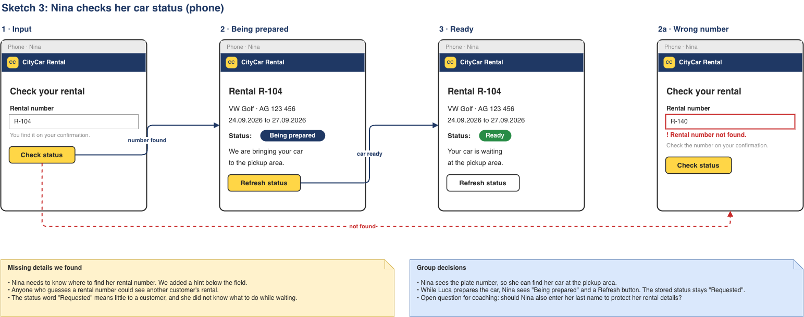

# CityCar Rental — car-rental-web-app

**Current stage:** Milestone 1 — design draft. This README is the living project document; milestones are added to it rather than to separate files.

## Project overview

CityCar Rental is a small car rental branch. Rentals are agreed at the service desk, but the cars stand in a yard behind the building, and a second employee has to fetch them. Today that handover runs on shouting across the yard and paper notes, so cars are fetched in the wrong order, the desk cannot tell a waiting customer whether their car is ready, and customers queue at the desk to ask.

This web application replaces those notes with one shared status per rental. The service desk creates a rental and picks a free car; the request appears immediately in the yard worker's queue with the parking spot; when the car is at the pickup area the yard worker marks it ready, and both the desk and the customer see that at once. Customers check their own rental on their phone with the rental number instead of asking at the desk.

**Intended users:** service-desk staff and yard staff (staff app on a tablet), and rental customers (status page on a phone).

**Initial scope:** the three workflows below — create a rental, prepare the car, check the status. Payment, insurance options, online self-booking, returns, cleaning logs and damage reports are deliberately out of scope for the first version.

### Team and initial responsibilities

| Member | Initial responsibility | Next action |
|---|---|---|
| Fabian | Repository, README and data model | Keep the decisions, open questions and milestone commits together; maintain the example JSON |
| Samson | Workflows, sketches and prototype | Keep the workflow tables current; refine the sketches and the clickable prototype |

The project is a two-person team, so the template's four suggested roles are shared between us rather than split further. Both of us reviewed every workflow, sketch and decision together — the table records who drove each part, not who understands it. Responsibilities rotate as the project moves from design to implementation: for Milestone 2 the split will follow the contract (Fabian) and the FastAPI implementation with tests (Samson).

## 1. Analysis

### Scenario, users and goals

- **Situation or problem:** the service desk and the yard do not share a live view of a rental. Requests are passed on informally, so cars are prepared in the wrong order, and nobody at the desk can answer "is my car ready?" without walking into the yard.
- **Intended users:** *Marco*, service desk — needs to record a rental quickly and see which cars are ready to hand over. *Luca*, yard — needs to know which car to fetch next and where it is parked. *Nina*, customer — wants to know when her car is ready without queuing at the desk.
- **Proposed benefit:** one status per rental, visible to all three roles at the same time. Fewer wrong cars fetched, no repeated questions at the desk, and a customer who can wait comfortably instead of standing in line.
- **Initial scope:** one rental holds one customer and one car. The first workflow to explore is creating a rental, because the other two depend on the data it produces.

### User stories and first workflow

- As a **service-desk employee**, I want to create a rental with a car that is actually free, so that the yard receives a complete and correct request.
- As a **yard worker**, I want to see which cars are requested and where they are parked, so that I fetch the right car next without searching the yard.
- As a **customer**, I want to check whether my car is ready, so that I do not have to ask at the desk.

**Out of scope for now:** changing or cancelling a rental after submitting, returns and mileage, payment and insurance, damage reporting, and any customer self-service booking.

#### Workflow 1 — Marco creates a rental (the first workflow)

| Step | User / role | Action | Information needed | Expected result or feedback |
|---|---|---|---|---|
| 1 | Marco, service desk | Enter the customer's name and licence number | Customer name, licence number | Inputs are kept ready; nothing is saved yet |
| 2 | Marco | Choose pickup date, return date and car category | Pickup date, return date, category | Only cars free in that category for that period are listed |
| 3 | Marco | Select a car and submit | Selected car | All fields filled, return date after pickup date, car still free |
| 4 · success | Marco | Read the confirmation | — | Rental number and plate are shown; the rental enters the yard queue as *Requested* |
| 3a · alternative | Marco | Submit with the licence number missing | — | "Enter the licence number" next to the field; other inputs kept; no rental created |
| 2a · alternative | Marco | No car is free in the chosen category | — | The app says so and lists free cars from other categories |

#### Workflow 2 — Luca brings the car

| Step | User / role | Action | Information needed | Expected result or feedback |
|---|---|---|---|---|
| 1 | Luca, yard | Open the yard queue | — | Requested rentals, earliest pickup first, with plate, parking spot and customer name |
| 2 | Luca | Choose the next rental | Rental number | Car details and where the car is parked |
| 3 · success | Luca | Bring the car to the front and mark it *Ready* | — | Status updates so Marco and Nina see the car is waiting; the rental leaves the queue |
| 1a · alternative | Luca | Open an empty queue | — | "No cars are requested right now" |

#### Workflow 3 — Nina checks her status

| Step | User / role | Action | Information needed | Expected result or feedback |
|---|---|---|---|---|
| 1 | Nina, customer | Open the status page and enter her rental number | Rental number | Hint below the field explains where to find the number |
| 2 | Nina | Submit the rental number | — | The number is checked against existing rentals |
| 3 · success | Nina | Read the status | — | Car, plate and status; when *Ready*, told to go to the pickup area |
| 2a · alternative | Nina | Submit a wrong rental number | — | "Rental number not found, check your confirmation"; input kept for correction |

**Exception worth discussing:** the "no car free in this category" case. We show free cars from other categories instead of an empty list, but it is open whether Marco may simply book across categories at the same price, or whether that needs a supervisor's approval. See the open questions in section 3.

## 2. Design

### Screens and navigation

**Live project site:** <https://fab132.github.io/car-rental-web-app/> — the clickable prototype and the sketches, served from the `docs/` folder of this repository.

The sketches cover the shared layout plus one page per workflow, each with its alternative states. Click an image to open it full size — the pages are wide, because every state of a workflow is drawn side by side.

**Shared identity and navigation**

Identity, colour roles (navy for navigation, yellow for the main action, green for *Ready*, red for errors, grey for hints and *Handed over*), the three status badges, the staff Home screen and the navigation map.

**Workflow 1 — Marco rents a car (tablet)**

States drawn: *1 Input*, *2 Success*, *3 Overview*, and the two alternatives *2a Missing input* and *2b No car free*. The red arrows show which input leads to which alternative.

**Workflow 2 — Luca brings the car (tablet)**

States drawn: *1 Yard queue*, *2 Rental details*, *3 Success*, and the alternative *1a Empty queue*.

**Workflow 3 — Nina checks her status (phone)**

States drawn: *1 Input*, *2 Being prepared*, *3 Ready*, and the alternative *2a Wrong number*.

Each sketch page carries two notes in its lower half — *Missing details we found* and *Group decisions* — which are the source of the decisions table in section 3.

**Sources and earlier iteration.** The editable originals are [`docs/sketches/car-rental-sketches.drawio`](docs/sketches/car-rental-sketches.drawio). Our first iteration is kept alongside them in [`docs/sketches/first-version/`](docs/sketches/first-version/) with its source file, so the change is visible: it had no shared identity page and no Overview screen, and both were added once we noticed Marco had nowhere to see which cars were ready.

**Clickable prototype (exercise 3).** **[Open the prototype](https://fab132.github.io/car-rental-web-app/prototype/)** — 16 static screens plus a start page, built with Bootstrap Studio and published with GitHub Pages, so no download is needed. The source is in [`docs/prototype/`](docs/prototype/). Buttons lead to the next screen; nothing is saved. Follow the suggested journey: Marco creates R-104 → Luca marks the car ready → Nina checks her phone → Marco marks it handed over.

**Navigation.** Staff work on a tablet with four top-level entries: Home, New rental, Overview, Yard queue. The customer page is a phone screen with no navigation at all — Nina only ever sees the check form and her own status, reached from a link on her confirmation.

**Main inputs, actions and feedback.** The staff app has exactly three actions that change data: *Create rental*, *Mark ready*, *Mark handed over*. Each one leads to a confirmation screen that restates what happened and names the next person in the chain ("Sent to the yard queue. Luca brings the car to the front."), because the three roles never see each other's screens. Errors appear next to the field that caused them and keep the other inputs. Status is shown as a coloured badge throughout — grey *Requested*, green *Ready*, grey *Handed over* — so the same rental reads the same way on every screen.

### Domain concepts and example data

Three things: **cars**, **customers** and **rentals**. A rental references one car and one customer.

- [`data/examples/cars.json`](data/examples/cars.json) — 5 cars
- [`data/examples/customers.json`](data/examples/customers.json) — 4 customers
- [`data/examples/rentals.json`](data/examples/rentals.json) — 4 rentals

All values are fictional. The files are consistent with each other and with the prototype screens: `rentals.json` references `car_id` from `cars.json` and `customer_id` from `customers.json`.

**Important fields and value types**

| Object | Field | Type | Note |
|---|---|---|---|
| car | `car_id` | integer | Internal identifier, never shown to users |
| car | `plate` | string | What staff and customers actually recognise, e.g. `"AG 123 456"` |
| car | `category` | string, one of `compact` / `suv` / `estate` | Marco filters by this |
| car | `parking_spot` | string | Where the car stands in the yard, e.g. `"B12"`; Luca needs it |
| customer | `licence_number` | string | Required; kept as text because of country prefixes like `"CH 1234567"` |
| rental | `rental_number` | string | Human-readable, e.g. `"R-104"`; spoken aloud and typed by the customer |
| rental | `pickup_date`, `return_date` | string, ISO 8601 date | Stored as `2026-09-24`, shown as `24.09.2026` |
| rental | `pickup_time` | string, `HH:MM` | Sorts the yard queue |
| rental | `status` | string, one of `requested` / `ready` / `handed_over` | The one value all three roles share |

**Marked uncertainties**

- Cars deliberately have **no `available` flag**. Availability is derived from rentals whose period overlaps the requested one — otherwise two sources could disagree. In the example data, `R-103` holds the only SUV from 23 to 28 September, which is exactly why Marco's "No SUV is free for these dates" screen is correct for a 24–27 September request.
- `pickup_date` and `pickup_time` are separate fields. One combined timestamp may be cleaner; we kept them apart because the sketches show a date picker and a queue sorted by time of day.
- `parking_spot` sits on the car, not on the rental. Once Luca moves the car to the pickup area the stored spot is stale. Whether the pickup area is just another spot value is open.
- `rental_number` is currently the only identifier for a rental. Whether it also needs an internal numeric id is open.
- The customer sees **"Being prepared"** while the stored status is still `requested`. The display label and the stored value are intentionally not the same, because "Requested" means little to a customer.

### Business rules and possible operations

**Rules**

1. Customer name and licence number are required; without them no rental is created.
2. The return date must be after the pickup date.
3. Only cars free for the whole period may be selected. If the chosen category has none free, free cars from other categories are offered instead of an empty list.
4. A new rental always starts as `requested` and appears in the yard queue.
5. A rental leaves the yard queue when it is marked `ready`.
6. Only a rental with status `ready` can be marked `handed_over`.
7. One customer and one car per rental in the first version; no editing or cancelling after submitting.

**Rule and exception in plain language.** A car may only be rented to one customer at a time, so a car whose rental overlaps the requested dates is not offered. The exception is the category: when nothing in the requested category is free, the app does not refuse the rental — it shows what *is* free elsewhere and lets Marco decide. Where this is enforced in the implementation will be documented at Milestone 2.

**Proposed operations** (draft intentions, not implemented endpoints)

| User goal | Proposed action | Example input | Expected output | Open question |
|---|---|---|---|---|
| See which cars Marco may pick | Read the free cars for a period and category | `category=compact`, `2026-09-24` to `2026-09-27` | List of free cars with plate and category | Should a full category return other categories, or should the caller ask again? |
| Create a rental | Create a rental | `{"customer_name": "Nina Keller", "licence_number": "CH 1234567", "car_id": 1, "pickup_date": "2026-09-24", "return_date": "2026-09-27", "pickup_time": "09:00"}` | Rental number, plate and status `requested` | Should an existing customer be reused instead of created again? |
| Fetch the next car | Read all rentals with status `requested`, sorted by pickup time | — | Rental number, plate, parking spot, customer name | Only today's, or all future ones? |
| See where one car is parked | Read one rental | `R-104` | Car, parking spot, customer, pickup time, status | — |
| Report the car as ready | Change a rental's status to `ready` | `R-104` | Updated status, visible to all three roles | What if Luca marks the wrong rental ready? |
| See today's rentals at the desk | Read today's rentals sorted by pickup time | `2026-09-24` | Rental number, time, customer, car, status | — |
| Hand over the keys | Change a rental's status to `handed_over` | `R-104` | Updated status | Reject when the rental is not yet `ready`? |
| Let the customer check her rental | Read the public status of one rental | `R-104` | Car, plate, dates and a customer-friendly status | Is the rental number alone enough to identify her? |

The final endpoint shapes follow after coaching; this table records the intended behaviour.

### Inspiration from existing apps or APIs — optional

Parcel-tracking pages (for example Swiss Post) show one shipment reduced to a single status plus a short sentence on what happens next, with no login. Nina's status page copies that idea: one number in, one status and one instruction out. What we would improve is honesty about time — a tracking page often shows a stale status without saying when it was last updated, so we added an explicit *Refresh status* button rather than implying the page is live.

## 3. Project management

### Decisions, open questions and next steps

| Question / decision | Current position | Next step / person |
|---|---|---|
| How does Marco handle a returning customer? | Undecided. He currently retypes name and licence for every rental, which duplicates customer records | Ask in coaching whether to search existing customers in version 1 |
| Can anyone who guesses a rental number see a stranger's rental? | Open and the most important gap we found. Rental numbers are sequential and easy to guess | Discuss requiring the last name alongside the rental number |
| What if Marco picks the wrong car after submitting? | No editing in version 1 | Confirm this is acceptable for the milestone, then plan a correction path |
| What if the car is damaged or not at its spot? | Out of scope for version 1; Luca tells Marco directly | Revisit when the three workflows are implemented |
| May Marco book across categories when one is full? | The app offers free cars from other categories; whether that is allowed and at which price is open | Ask the lecturer / treat as a business decision |
| In which order does Luca work the queue? | **Decided:** by pickup time, earliest first | Done |
| Where does Marco see which cars are ready? | **Decided:** the Overview screen, which also carries the hand-over action | Done |
| What does the customer see while the car is being fetched? | **Decided:** "Being prepared" with a Refresh button; the stored status stays `requested` | Done |
| Does a rental ever hold more than one car? | **Decided:** one car and one customer per rental in version 1 | Done |

### Milestone progress

| Milestone | Available evidence | Status / next step |
|---|---|---|
| 1 — Design draft | Three workflows with alternatives ([`docs/exercise1-workflows.docx`](docs/exercise1-workflows.docx)), sketches for all three plus shared navigation, embedded as images in section 2 ([`docs/sketches/`](docs/sketches/)), a 17-page clickable prototype, [published live](https://fab132.github.io/car-rental-web-app/prototype/) ([`docs/prototype/`](docs/prototype/)), consistent example JSON ([`data/examples/`](data/examples/)) and the proposed operations above | Complete and ready for submission |
| 2 — Contract and available implementation | — | Turn the proposed-operations table into an OpenAPI contract, then implement with FastAPI and tests |
| Integration — later | — | Update after the classroom examples; frontend decision still open, the Bootstrap Studio prototype is a candidate starting point |

Contributions are described per person in the responsibilities table and in the decisions above; commit counts are not a measure of individual effort.

## 4. References and acknowledgements

- **draw.io / diagrams.net** — screen sketches and navigation map (`docs/sketches/`).
- **Bootstrap Studio** with **Bootstrap 5** — the clickable prototype in `docs/prototype/`, published with **GitHub Pages** from the `docs/` folder. The generated CSS was kept as exported; only content and screen states are ours.
- **Inter** (with a system sans-serif fallback) — typeface used in the sketches and prototype.
- **FastAPI** — the framework planned for Milestone 2, following the HS26 Python/FastAPI teaching path.
- Course material: exercise 1 (workflow tables), exercise 2 (sketches) and exercise 3 (clickable prototype) from the design sessions. The bar-ordering scenario used in class was replaced with our own car-rental scenario; we kept its structure of a workflow table with numbered alternatives.
- Template lineage: the earlier [Pizzeria Reference Project](https://github.com/FHNW-INT/Pizzeria_Reference_Project) organised documentation around analysis, design, implementation, execution and project management. This README follows the HS26 template that updates that structure; the Pizzeria project's Java/Spring and hosted Budibase instructions do not apply here.

No credentials or personal data are stored in this repository; all names, licence numbers and plates in the example data are invented.

## Friday handoff checklist

- Commit this README and the available draft material before the milestone.
- First join the module's MS Team using the link in Moodle. The lecturer will then add you to your group's private channel during the week.
- Submit the GitHub repository link in Moodle by Friday, following the milestone instructions published after class.
- Ensure the lecturer can access the repository; public visibility is not required.
- If you do not yet have a group channel and your team composition is not recorded in Moodle's team formation activity, email the lecturer with all team members' names.
- Refer to Moodle for the milestone date and the full assignment requirements.
